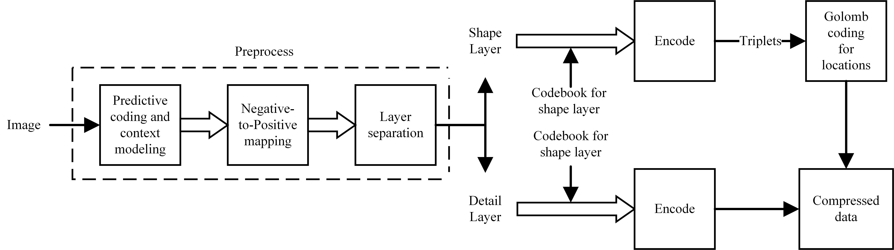
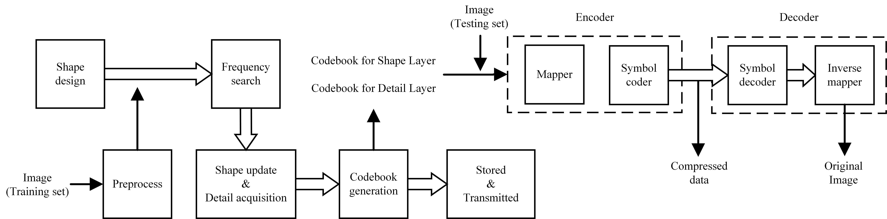

# Soft Compression for Lossless Image Coding

## [[Paper]](https://arxiv.org/pdf/2012.06240.pdf) [[Citation]](#citation)

### Abstract

Soft compression is a lossless image compression method, which is committed to eliminating coding redundancy and spatial 
redundancy simultaneously. To do so, it adopts shapes to encode an image. In this paper, we propose compressible 
indicator function with regard to images, which gives a threshold about the average number of bits required to 
represent a location and can be used for illustrating the performance of soft compression. We investigate and analyze 
soft compression for binary image, gray image and multi-component image by using specific algorithms and compressible 
indicator value. In terms of compression ratio, soft compression algorithm outperforms the popular classical standards 
PNG and JPEG2000 in lossless image compression. It is expected that the bandwidth and storage space 
needed when transmitting and storing the same kind of images (such as medical images) can be greatly reduced by applying 
soft compression.

### Framework and Role
- This code is designed for soft compression, which is in lossless mode. 
- The code can train and test the results on Fashion-MNIST, DRIVE and PH2.
- For other datasets, just do a few changes can achive the compression effect.
#### Encoder
<div align="center">
  
</div>

#### Overall Procedure
<div align="center">
  
</div>

## Prerequisites for Code

Required packages:
```
pip install opencv-python --user
pip install opencv-contrib-python --user
pip install numpy
```

Datasets:

```
Fashion_MNIST: https://github.com/zalandoresearch/fashion-mnist
DRIVE: https://aistudio.baidu.com/aistudio/datasetdetail/27737
PH2: https://www.fc.up.pt/addi/ph2%20database.html
     https://www.kaggle.com/hashbanger/ph2-dataset
```


##### Notes
- We tested this code with Python 3.8 and opencv 4.0.1.
- The code also works with other versions of the packages.


## Main Modules
- To train a model yourself, you have to firstly prepare the data as shown in [[Prerequisites for Code]](#prerequisites-for-code)
- Then, put them into foler 'Dataset'
- Run 'MainProgram.py' to get the results with soft compression in Table 4
- Run 'MainProgram2.py' to get the results with soft compression in Table 2
- Run 'MainProgram3.py' to get the results with soft compression in Table 3
- Run 'Other_s.py' to get the resluts with some baselines in Table 2
- Run 'Other_m.py' to get the resluts with some baselines in Table 3  


## Other Information

Baselines used:
```
JPEG2000: http://www.openjpeg.org/
JPEG-LS: https://github.com/thorfdbg/libjpeg
Adaptive Arithmetic coding: https://github.com/nayuki/Reference-arithmetic-coding
```
**NOTE**: The program may take a long time. We run it with multiprocessing. You can choose optional methods to accelerate it

## Future Work

- Iterative soft compression algorithm makes it have better performance
- Optimize program and improve efficiency

## Citation

If you use the work released here for your research, please cite this paper:
```
@article{xin2020soft,
  title={Soft Compression for Lossless Image Coding},
  author={Xin, Gangtao and Fan, Pingyi},
  journal={arXiv preprint arXiv:2012.06240},
  year={2020}
}
```
